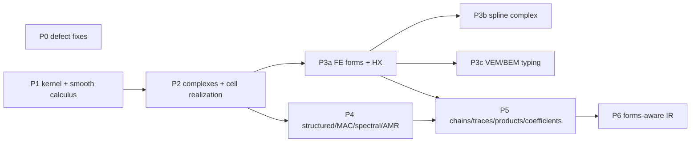

# Native exterior-calculus substrate: end-to-end implementation plan

- Baseline: `dev` at `62abd2db0`, clean, with #380 and #381 merged.
- This is the complete execution contract for P0–P6 on the single fresh worktree `/Users/lgleyzer/PHYDRA/phydra-labs/.worktrees/exterior-calculus-complete`; no implementation occurs on the parent branch and no commits or PRs are automatically requested.
- Baseline paths and line numbers are research references, not current declarations. Implemented signatures and canonical owners govern migrations.
- Binding review corrections are folded into the relevant sections below. Items still marked [verify] require an independent oracle; confirmed or withdrawn findings are identified explicitly.

## 0. Baseline facts that constrain the design

1. **Canonical carriers already exist and stay canonical.**
   - The carriers are `CellComplexTopology`/`OrientedIncidence` (d∘d = 0 is validated) and `CochainDiscretization` (d = Bᵀ, δ = M⁻¹dᵀM, diagonal or dense Hodge).
   - `_integration_guardrails.CANONICAL_CORE_OWNERS` registers them as `"cell_complex"` and `"cochain"`.
2. **Duplicated calculi to absorb:**
   - two smooth calculi with the same sign tables (`metrix/_forms.py`, `operators/differential/_form_ops.py`), plus five private basis tables;
   - six sites that compute determinants of minors;
   - a graph re-pack of the cochain complex (`graph/_cochain.py`). It has its own identity, a NumPy/SciPy spectrum, and its own homology and harmonic frames;
   - `CochainMetricPlan/State`, which is diagonal-only and has one caller;
   - three Hodge Laplacians: cochain, GraphIR, and the unweighted `SimplicialHodgeLaplacian`;
   - five copies of barycentric gradients / Whitney forms, plus a standalone Nédélec tetrahedron;
   - FE conformity and mapping stored as free strings;
   - a private IGA spline complex;
   - duplicated helpers: `_box_geometry`, MAC `_difference`, reduced `_forward`/`_backward`;
   - three plaquette / ordered-path stacks.
3. **#381 substrates are composed, not duplicated:**
   - `AbstractFieldReconstructionKernel` and `PreparedFieldQuery`. There is no compatible-field kernel yet, and FE refuses Piola fields at `fem/_point_interpolation.py:92-93` and `:756-761`.
   - `SideTraceProvider`.
   - `BoundaryTraceSpaceCapability` and `sparse_gram_trace_space`, which is the template for a sparse Gram/Riesz map.
   - `linalg._named_blocks`: `BlockSelection`, `BlockRestrictionLinearOperator`, `assemble_block_operator`, `select_block_operator`.
   - `linalg._subspace_correction`; `fem/_low_order_auxiliary.py`; `prepare_maxwell_fem_bem_3d`.
4. **linalg facts the plan relies on:**
   - `adjoint()` already returns M⁻¹dᵀM.
   - `ComposedLinearOperator` drops properties.
   - `FunctionLinearOperator` needs explicit ids.
   - `compatible` compares only `space_id`.
   - Fingerprints skip tracers.
   - `with_inactive_identity` is a Boolean switch for a whole operator, not a per-DOF mask.
   - `self_adjoint_spectral_subspace` is dense.
   - `GeneralizedEigenproblem`, `LOBPCG` and `RestartedLanczos` exist.
   - `SparseCholesky` (CHOLMOD) and SuperLU factor on the host.
   - `refresh_sparse_assembly` refreshes values on a fixed sparsity pattern.
   - `_assembly.py` has composition, block-diagonal and Kronecker recipes, but no general block recipe.
   - `determinant_small_linear` covers sizes 1–4.
5. **Import graph:**
   - `domain` eagerly imports `metrix` (`_riemannian_measure.py:13`, `_referenced_density.py:15`);
   - `metrix` imports `discretization`;
   - `linalg` imports `_model`;
   - `graph` imports `discretization`.

   So smooth forms keep two carriers, both over one kernel and one `FormType`: the chart callable in metrix, and `DomainFunction` in `operators.differential`.
6. **Reach of `StructuredCochainBridge`:** 35 package files, 54 test files, 14 examples and 8 tools use it. Its name, its pack/unpack/proxy API and its `bridge_id` inputs are therefore retained.

## 1. Frozen conventions

Each row is pinned by a property test.

| Item | Convention |
|---|---|
| Basis | Increasing multi-indices in lexicographic order, `combinations(range(N), k)`. Forms, `compound_matrix`, Clifford grade-major blades and spline components all share it. |
| Smooth coefficients | Shape `(*batch, C(N,k), *fiber)`, where N is the ambient dimension. The component axis is always present: rank is stable, and the axis has size 1 for k ∈ {0, N}. |
| Discrete d | d_k = B_{k+1}ᵀ. A stencil realization must equal the incidence. |
| Discrete ⋆ | The Riesz map of Vᵏ: Vᵏ → Dual(Vᵏ) ≡ twisted (n−k)-cochains on the dual complex. |
| δ | δ_k = adjoint(d_{k−1}) = M_{k−1}⁻¹ d_{k−1}ᵀ M_k, the positive Hilbert adjoint. Physical divergence = −δ. |
| Dual complex | d̃ on Dual(Vᵏ) is (−1)ᵏ d_{k−1}ᵀ (Hirani), so δ_k = (−1)ᵏ ⋆⁻¹ d̃ ⋆. With the dual-side star ⋆̃ = (−1)^((k−1)(n−k+1)) M_{k−1}⁻¹, the smooth identity δ = (−1)^(n(k+1)+1) ⋆̃ d̃ ⋆ holds verbatim, because the exponents sum to 0 mod 2. |
| Smooth ⋆ | Orientation-free: maps untwisted Λᵏ to twisted Λⁿ⁻ᵏ. ⋆⋆ = (−1)^(k(n−k)+q) and δ = (−1)^(n(k+1)+q+1) ⋆d⋆, where q is the metric's negative index. Every `orientation` argument is removed; `to_untwisted(form, orientation)` and `to_twisted` are explicit. |
| Twist algebra | ∧ XORs twist; d, ι and ℒ preserve it. Pulling back a twisted form multiplies by sign det J when J is square. Otherwise the pullback is refused unless a co-orientation is supplied; traces supply the outward one. |
| Orientation | Induced boundary orientation is outward-normal first. Reorienting cell σ negates values on σ for degree ≥ 1. |
| Boundary | `ComplexBoundary = Literal["absolute","relative"]`. "Relative" means the active-coordinate subcomplex, with restricted incidences and restricted Hodges. It is never a masked full inverse. |
| Proxies | `FormProxy = Literal["scalar","circulation","flux","density","components"]`. See the proxy rules below the table. |
| Maxwell roles | E and B are untwisted primal (degrees 1 and 2 in 3-D). H, D, J and ρ are twisted, stored as ⋆⁻¹ of their dual cochains, which is today's primal layout. ρ = −δD, Ḋ = δH − J, Ḃ = −dE − M. |
| PIC | Deposited current = +∫W (flux content). Continuity is ρ̇ − δJ = 0 in primal coordinates. |
| Fourier | ∂̂ = +ik, unchanged. |

Proxy rules:
- **scalar**: k = 0.
- **circulation**: k = 1. Values are Cartesian components; maps with the covariant Piola transform.
- **flux**: k = n−1. The proxy is the vector v with ι_v vol = ω; the component for [0..n)∖{i} is (−1)ⁱvᵢ. Maps with the contravariant Piola transform. In 2-D the flux packs as (−v_y, v_x); in 3-D the faces (xy, xz, yz) are (v_z, −v_y, v_x). Both match today's bridge packing.
- **density**: k = n.
- **components**: any k.
- Ambiguous degrees (n = 1, or n = 2 with k = 1) require an explicit proxy.
- In a Piola map, a signed determinant means untwisted and an absolute one means twisted.

## 2. Ownership and layering

| Capability | Owner |
|---|---|
| `FormType`, `FormValueSpec`, basis tables, algebra kernels, proxies, `AbstractDeRhamComplex`, `DiscreteForm`, de Rham/Whitney bridge, spectra, cohomology, chain integration, traces, products, coefficient systems | `phydrax.exterior` (new; lazy facade) |
| `compound_matrix`, `HilbertComplex`, `ComplexMap`, Hodge Laplacian, decomposition, harmonic subspace, mixed saddle, Hiptmair–Xu | `phydrax.linalg` |
| `CochainDiscretization`, `DiagonalHodge`/`SparseHodge`, DEC dual Hodges, cubical complex, structured bridge, cubical Whitney kernels | `phydrax.discretization` |
| Form elements, `FiniteElementDeRhamComplex`, simplicial Whitney kernels | `discretization.fem` |
| `SplineDeRhamComplex` (made public) | `discretization.iga` |
| `FourierDeRhamComplex`, `SphericalDeRhamComplex` | `discretization.spectral` |
| Chart forms / domain forms | `metrix` / `operators.differential` |
| GraphIR lowering | `graph` |
| Exact algebra (Betti numbers, generators, cup diagonals) | `topology` |

**Import rule** (integration runs an import-time smoke check):
- `exterior/_form_type.py` and `exterior/_basis.py` are dependency-minimal metadata/kernel owners: no imports of discretization, domain, metrix, operators or graph.
- `exterior/_algebra.py` and `exterior/_complex.py` may also import `linalg` and `ein`. `_chains.py` is a core chain protocol/fixed sparse-query owner, with no concrete discretization dependency; concrete cubical/simplicial geometry stays in discretization.
- Layer-3 orchestration (`_de_rham`, `_spectra`, `_cohomology`, `_traces`, `_products`, `_coefficients`) may import `metrix`, `discretization`, `operators` and `topology`. `AbstractCellDeRhamComplex` lives in `discretization/_cell_de_rham.py`, not exterior core.
- No module-level import of a Layer-3 module from `domain`, `metrix`, `discretization`, `operators` or `graph`.

**Guardrail kinds:**
- P1: `"differential_form_type"` → `phydrax.exterior.FormType` (informational canonical owner descriptor, not enforcement).
- P2: `"de_rham_complex"` → `phydrax.exterior.AbstractDeRhamComplex`.
- P2: `"hilbert_complex"` → `phydrax.linalg.HilbertComplex`.
- P2: `"complex_map"` → `phydrax.linalg.ComplexMap`.

## 3. Phase map

P0–P6 are dependency phases of one complete cutover in the same authoritative worktree, not separate PR/worktree requirements. Owners implement independent slices concurrently after shared contracts are fixed; the integration owner runs build, lint, formatters and tests once after integration. No phase boundary reduces the full deliverable.



## 4. Phases

### P0 — Defect fixes

Rules:
- Every fix ships with a regression test that fails on `dev` first.
- The test's oracle must be independent of the implementation.
- For a [verify] item: if the oracle agrees with `dev`, the item closes as not-a-bug, and the oracle test stays as a contract test.

| ID | Change | Regression test |
|---|---|---|
| D1 | Cut-cell preparation retains mesh boundary masks in the canonical `CochainDiscretization`. | `tests/unit/discretization/test_block_amr_cut_complex_3d.py`: relative δ zero-extends boundary DOFs; absolute preserves the unrestricted action. |
| D2 | `topology/_advanced.py:103,207,281,420`: topology ids come from canonical content (simplices + filtration parameters). | `tests/unit/topology/test_advanced_capability_families.py`: distinct clouds give distinct ids; equal clouds give equal ids. |
| D3 | `topology/_advanced.py` `cup_product`: refuse unequal `topology_id`; reduce a, b and c mod p, then compute t=(a*b)%p and t=(c*t)%p before int64 scatter, reducing accumulated terms before narrowing. | Same file. Use p = 2147483629 against a Python-int oracle, plus mismatch refusal. |
| D4 | `solver/_fem_bem_vector.py:67-70`: the support report classifies the nonmatching 3-D Maxwell mortar route (`prepare_maxwell_fem_bem_3d`, `solver/_nonmatching_fem_bem3d.py:144`) as supported. Matching-mesh Maxwell stays unsupported until P5. | `tests/unit/solver/test_fem_bem_vector.py`: check the status fields of the report, not its wording. |
| D5 | `docs/api/linalg.md:521` and `docs/guides_particle_local_solves.md:3`: small solves cover 1×1 through 4×4. | Docs only. |
| D6 | `docs/guides_particle_in_cell.md:56-58`: say "lowest-order Whitney" (matches CHANGELOG). | Docs only. |
| D10 | `kernels/_operator_valued.py:696-697`: `kernel_id` includes the ambient dimension and the projector's derivative order. | `tests/unit/kernels/test_operator_valued.py`. |
| D11 | `graph/_cochain.py`: `CochainComplexIR.fingerprint` includes coordinates. | `tests/unit/graph/test_cochain.py`. |
| D13 confirmed | `fem/_generic.py`: all four tetrahedral H(div) faces are mismatched; match reference faces by vertex sets, including HDivStokes consumers. | `tests/unit/discretization/test_tetrahedral_hdiv.py`: two tetrahedra share a face with misaligned numbering. Non-vacuous normal-component continuity at face quadrature points ≤ 1e-12, for both RT and BDM. |
| D14 | `solver/_cochain_pic_field.py`: gather constrained raw `magnetic_flux` as physical B, not H. The bug is reachable in passive magnetic dispersive PIC. | `tests/unit/solver/test_pic_field_solver.py`: with μ = 2 and uniform B, Lorentz force equals q v×B. |
| D17 | `solver/_maxwell_unstructured.py:222-227`: the degree-3 Hodge is 1/volume, which is the Whitney-3 Galerkin mass. | `tests/unit/solver/test_maxwell_platform.py`: ⋆₃ applied to the cochain of a constant density returns that density. |
| D18 | `discretization/_structured_cochain.py` `unpack`: add a degree range check. | Bridge contract test. |
| D19 | Add `StructuredCochainResourcePolicy` (`_structured_cochain.py`) and `EntitySelection` (`discretization/_topology.py`) to `__all__`. | Manifest check. |
| D24 [verify] | `applications/lattice_field/_distributed_qcd.py:365-417`: staples are U·S, while the provider (`backends/lattice.py:290-291`) computes U·S†. Oracle: the force equals −∂S/∂U in algebra coordinates, computed with `jax.grad` of the Wilson action. | `tests/unit/applications/test_distributed_qcd_production_closure.py` |
| D25 [verify] | `applications/lattice_field/_hamiltonian_gauge.py:394-397` Gauss sign vs `discretization/_oriented_path.py:36`. Oracle: the Gauss generator commutes with H, and its sectors equal the divergence of the oriented incidence. | `tests/unit/applications/test_hamiltonian_gauge_production_closure.py` |
| D26 [verify] | `applications/lattice_field/_qcd_observables.py:512` vs `:566`: `wilson_action_density` should have one normalization. Oracle: an abelian constant-flux configuration gives S = β Σ(1 − cos θ). | `tests/unit/applications/test_qcd_application_production_closure.py` |
| D27 | `docs/guides_advanced_topology.md:97-98`: remove the advertised Alexander–Whitney helper, which does not exist; P5 implements it. | Docs only. |
| D33 | RWG `non_goals`: remove BC/RBC. Delete the wording assertions at `tests/unit/operators/test_maxwell_boundary3d.py:127-128` (wording tests are deleted, never re-pinned). | — |
| D35 | `topology/_advanced.py` `CellularSheaf`: key restrictions by incidence entry, preserving repeated face occurrences. | A one-vertex circle with the constant sheaf gives H⁰ = H¹ = ℝ; include repeated-incidence admission evidence. |

- **CHANGELOG:** one "Fixed" bullet per user-visible fix.
- **Generated data:** run `python -m tools.generate_public_api_manifest` and `python -m tools.generate_capability_inventory`.
- **Verification:** affected behavioral contracts are selected per slice; no agent runs checks midflight. Parent runs the integrated suite and runtime smoke scenarios.

### P1 — One exterior-algebra kernel and the smooth calculus

#### New files

**`phydrax/linalg/_compound.py`**
- Signature: `compound_matrix(matrix: ArrayLike, degree: int, /, *, maximum_minor_entries: int = 1 << 24) -> Array`.
- Shape: (…, m, n) → (…, C(m,k), C(n,k)). Rows and columns are k-subsets in lexicographic order.
- Special cases:
  - k = 0 gives ones of shape (…, 1, 1);
  - k > min(m, n) gives zero-extent axes where C = 0;
  - k < 0 raises ValueError;
  - exceeding the budget raises ValueError before anything is allocated;
  - k = 1 is the identity gather.
- Algorithm:
  - reuse the linalg determinant owner; `determinant_small_linear` requires a `SmallLinearSolvePlan`;
  - sizes ≤3 use polynomial derivatives; size4 must prove the adjugate derivative at rank3; larger minors require the correct determinant derivative at rank k−1, not the incorrect zero from a naive slogdet JVP;
  - correct singular-minor derivatives, not merely finite gradients, are the contract.
- Real and complex dtypes; k is static; safe under jit and vmap.

**`phydrax/exterior/__init__.py`**
- Lazy facade: `_FACADE_EXPORT_MODULES`, `__getattr__`, `__dir__` and an ordered `__all__`.

**`phydrax/exterior/_form_type.py`**
- `FormTwist: TypeAlias = Literal["untwisted","twisted"]`.
- `FormType(dimension, degree, /, *, twist="untwisted", fiber_shape=(), ambient_dimension=None)`:
  - final and static;
  - validates 0 ≤ degree ≤ dimension ≤ ambient.
- Members: `form_type_id`, `component_count`, `value_shape`.
- Derived types (each refuses the invalid case):
  - `hodge_dual()` refuses ambient ≠ dimension;
  - `exterior_derivative_type()` refuses k = n;
  - `codifferential_type()` refuses k = 0;
  - `interior_type()`;
  - `wedge_type(other, *, product)` refuses k + l > n;
  - `trace_type()`;
  - `with_twist(twist)`.

**`phydrax/exterior/_basis.py`**
- Moved here from `metrix/_exterior_basis.py`: `exterior_indices`, `wedge_sign`, `axes_bitmap`, `bitmap_axes`.
- Cached host int tables: `wedge_table(n,k,l)`, `derivative_table(n,k)`, `interior_table(n,k)`, `complement_table(n,k)`.

**`phydrax/exterior/_algebra.py`** — pure JAX kernels:
- `FiberProduct: TypeAlias = Literal["scalar","matrix"]`.
- `wedge(left, right, left_type, right_type, /, *, product="scalar")`.
- `interior(vector, form, form_type)`.
- `exterior_derivative_from_jacobian(jacobian, form_type)`.
- `hodge_star(form, form_type, inverse_metric, volume_density)`: Λᵏ(g⁻¹) via `compound_matrix`, then complement signs. The output flips twist.
- `inner(left, right, form_type, inverse_metric)`: contraction through `phydrax.ein.contract`.
- `pullback(form, form_type, jacobian)`: Λᵏ(Jᵀ), with a sign det J factor when the form is twisted.
- `to_untwisted` / `to_twisted`.
- `hodge_square_sign` and `codifferential_sign`.

#### Changed files

**Smooth forms: `metrix/_forms.py`**
- New signature: `DifferentialForm(coefficients, /, *, chart, degree, twist="untwisted", fiber_shape=())`. The `indices` field is removed and derived instead.
- `wedge(..., product="scalar")`, `exterior_derivative`, `pullback_form`, `interior_product`, `lie_derivative`, `hodge_star(form, metric)`, `codifferential(form, metric)`, `hodge_laplacian(form, metric)`.
- New `to_untwisted` and `to_twisted`.
- `codifferential` of a 0-form now raises ValueError.
- The minors at `:197-200` and `:333-335` go through `compound_matrix`.

**Other metrix modules**
- `metrix/_bigraded_forms.py:20-28`, `metrix/_characteristic_forms.py:24-37`: tables come from the kernel.
  - `matrix_form_wedge` becomes `wedge(..., product="matrix")`, and the (r,r) fiber layout is unchanged.
- `metrix/_special_holonomy.py:219-228`: tables come from the kernel.
  - `LocalG2Structure` keeps its orientation and computes `to_untwisted(hodge_star(φ, g), orientation)`.
- `metrix/_symplectic.py`, `_kahler.py`, `clifford/_blades.py`, `clifford/_forms.py`: use the kernel tables.
- `clifford/_action.py`: minors via `compound_matrix`; action/layout plan ids use canonical input identities, never derived floating minor values.
- `metrix/_patchwise.py`: `transition_residual` applies the twisted sign.

**Domain forms: `operators/differential/_form_ops.py`**
- `DomainDifferentialForm(coefficients, /, *, chart, degree, twist="untwisted", var=None)`.
- `domain_exterior_derivative(form, /, *, mode, backend)` forwards the `grad` backends.
- `domain_hodge_star`, `domain_codifferential` and `domain_hodge_laplacian` take `(form, metric)`.
- New `domain_to_untwisted` and `domain_to_twisted`.
- `domain_maxwell_residuals(F, metric, /, *, electric_current, magnetic_current)` checks form types.
- A degree-0 codifferential raises; previously it returned a zero form with deps `(var,)`.
- The minors at `:407-411` go through `compound_matrix`.

**Other minors sites**
- `kernels/_operator_valued.py:577-591` uses `compound_matrix`. `ProjectedDifferentialFormKernel` stores a `FormType`.
- `graph/_continuous_bridge.py:191-192` uses `compound_matrix`.
- [verify] and migrate where they compute Λᵏ: `nn/models/_constitutive.py:44-65` and `imaging/camera/_triangulation.py:55-63`.

**Package registration:** `phydrax/__init__.py`, `_integration_guardrails.py`, `linalg/__init__.py`, `metrix/__init__.py`, `metrix/clifford/__init__.py`, `operators/differential/__init__.py`, `operators/__init__.py`.

#### Deleted files
- `metrix/_exterior_basis.py`.

#### Tests
- New `tests/unit/linalg/test_compound.py`:
  - Cauchy–Binet for rectangular and batched inputs; transpose, identity and inverse laws; Λⁿ = det;
  - lexicographic ordering; rank-deficient minors against independent adjugate derivatives, including rank3 size4 and rank k−1 larger minors;
  - k = 0 and k > min(m,n); complex dtype; jit and vmap; budget refusal.
- New `tests/unit/exterior/{_cases.py,test_contracts.py}`:
  - tables against brute-force permutations;
  - graded associativity and commutativity; d∘d = 0 on polynomial fields; Leibniz rule;
  - ⋆⋆ and δ signs for q ∈ {0,1}; α∧⋆β = ⟨α,β⟩ vol with no orientation; ι∘ι = 0; Cartan's formula;
  - naturality of pullback; sign under reflections; non-commutativity with matrix fibers;
  - degree refusals; FormType ids.
- New `tests/unit/metrix/test_form_twist.py`:
  - ⋆ flips twist; δ does not depend on orientation;
  - explicit degree0 component axis, including batch-size1; G2 orientation round trip; domain-form jet vs AD; derivative rules preserved; migrate the one old degree0-δ zero-result contract to refusal.
- New `tests/typing/cases/exterior_forms.py`: `assert_type` checks, plus misuse cases with `# ty: ignore[...]`.
- Migrated:
  - `tests/unit/metrix/test_geometry_families.py` (:112, :229), `test_clifford_geometry.py`, `test_g2_geometry.py`, `test_geometry_end_to_end.py`, `test_geometry_expansion.py`;
  - `tests/unit/integration/test_calabi_yau_observables.py`;
  - `tests/unit/operators/test_geometric_operators.py` (:59, :100), `test_maxwell_forms.py`;
  - `tests/unit/kernels/test_operator_valued.py`, `tests/unit/graph/test_continuous_bridge.py`.

#### Docs, tools and data
- **Docs:**
  - new `docs/api/exterior/index.md` and `docs/guides_exterior_calculus.md` (conventions table plus executable smooth snippets);
  - `docs/api/metrix/forms.md` (conventions at :3-24 rewritten);
  - `docs/api/metrix/{signed_metrics,complex_geometry,global_complex,special_holonomy,symplectic_poisson,clifford}.md`;
  - `docs/api/operators/differential.md:607-639`, `docs/api/kernels.md:309-342`, `docs/api/linalg.md` (compound section), `docs/guides_clifford_fields.md`;
  - `mkdocs.yml`: an "Exterior calculus" API group and a guide entry;
  - `docs/api/phydrax.md`, the README core-objects bullet, and `docs/all-of-phydrax.md:78`.
- **Tools:** `tools/geometric_benchmarks.py:67-80,210`, `tools/exotic_geometry_benchmarks.py`, `tools/calabi_yau_qualification.py:82-88`.
- **Data:** regenerate the manifest and the capability inventory.
- **CHANGELOG:** Added (exterior kernel, `compound_matrix`), Changed (orientation-free ⋆, twist, always-present component axis), Removed (`orientation` arguments).

### P2 — Hilbert complexes, the cell realization and graph lowering

#### New files

**`phydrax/linalg/_complexes.py`** — the Hilbert-complex API:
- **`HilbertComplex(spaces, differentials, /, *, complex_id)`** (final).
  - Validate degree count and d_k source/target identities; spaces and differentials are tuples.
  - Each d_k supports coordinate transpose; complex adjoints conjugate, and each space carries an SPD/Hermitian pairing.
  - Realizations supply explicit `FunctionLinearOperator.operator_id`; implicit default use cannot be detected reliably outside its owner.
  - Also provides `top_degree`, `space(k)` and `differential(k)`.
- **Nilpotency evidence:** `ComplexNilpotencyEvidence` and `complex_nilpotency_evidence(complex, /, *, key, probes=2, tolerance)`.
- **Codifferential and Laplacian:**
  - `codifferential(complex, k)` returns `adjoint(d_{k−1})`.
  - `HodgeLaplacianPart: TypeAlias = Literal["lower","upper","complete"]`.
  - `HodgeLaplacianOperator` is final and certified self-adjoint and PSD in the space pairing. `ComposedLinearOperator` would drop that certification.
  - `hodge_laplacian(complex, k, /, *, part="complete")` omits the lower part at k = 0 and the upper part at k = n; explicitly requesting a missing part raises.
- **Forms:** `mass_form(complex, k)`; `stiffness_form(complex, k)` = d_kᴴM_{k+1}d_k, certified PSD in Euclidean coordinates.
- **`mixed_hodge_laplacian(complex, k, /, *, harmonic=None) -> BlockLinearOperator`:**
  - built with named `assemble_block_operator` blocks and general sparse block assembly; self-adjoint on the coordinate-space endomorphism, never on a semantic V→Dual(V) view;
  - block "sigma" is absent at k = 0, and block "p" is absent when there is no harmonic space;
  - block matrix:

    ```
    [[−M_{k−1},    (M_k d_{k−1})ᴴ,   0   ],
     [ M_k d_{k−1}, d_kᴴM_{k+1}d_k,   M_kP],
     [ 0,          (M_kP)ᴴ,          0   ]]
    ```
- **`HarmonicSubspacePolicy`, `HarmonicSubspace` and `harmonic_subspace(complex, k, /, *, expected_dimension=None, policy=None)`:**
  - Pencil: (A, M_k) with A = d_kᴴM_{k+1}d_k + M_k d_{k−1} W d_{k−1}ᴴ M_k, where W = diag(M_{k−1})⁻¹.
  - The kernel is exactly the harmonic space, and computing it needs no inner solve. A equals M_kΔ_k when the Hodges are diagonal.
  - Small systems use the dense `self_adjoint_spectral_subspace` with `SpectralSelection(expected_dimension=b_k)`.
  - Large systems use `LOBPCG` on a `GeneralizedEigenproblem`, with block size b_k + oversampling.
  - The result reports gap, residual and M-orthonormality evidence. A dimension mismatch sets a failed status; it is never silent.
  - Omitted dimension is permitted only for bounded small eager dense admission; large/traced calls require an explicit expected dimension. Explicit dimension may use exact Betti evidence or declared numerical admission; status still checks residual, zero count and gap.
- **`HodgeDecompositionPolicy`, `HodgeDecomposition(exact_potential, exact, coexact, harmonic, orthogonality_defect, reconstruction_defect, solve_status, valid)` and `hodge_decomposition(complex, k, values, /, *, harmonic, lower_harmonic=None, policy=None)`:**
  - The exact potential mixed solve at k−1 requires harmonic bases at both k and k−1; respect boundary restrictions and nullspaces.
  - `prepare_hodge_decomposition(complex, k, /, *, harmonic, lower_harmonic=None, policy=None)` returns the repeated-solve artifact; lower_harmonic is mandatory when k>0. Its `.apply(values)` reuses mixed MINRES/block-preconditioner or explicitly prepared sparse-direct work.
  - The harmonic part is the M-orthogonal projection; the coexact part is the remainder.
  - k = 0 has no exact part.
- **`ComplexMap(source, target, maps, /, *, map_id, degree_offset=0)`**, with `ComplexMapEvidence(commuting_defects, valid)` and `complex_map_evidence(map, /, *, key, probes, tolerance)`.

**`phydrax/exterior/_complex.py`** — the realization protocol:
- `ComplexBoundary = Literal["absolute","relative"]`; no unconsumed `DeRhamCapabilities` flag vocabulary. Preserve the existing prepared-discretization `capabilities` field.
- **`AbstractDeRhamComplex`:**
  - AbstractVars: `dimension`, `primal_twist`, `realization_id`;
  - abstract `hilbert_complex(*, boundary)`; obtain degree vector spaces via this Hilbert complex, avoiding a conflicting `space()` method;
  - concrete methods:
    - `form_type(k, *, dual=False)`, `cell_counts`;
    - `exterior_derivative(k, v, *, boundary)`, `codifferential`, `hodge_laplacian(k, v, *, boundary, part)`;
    - `hodge_operator(k)`, `hodge_diagonal(k)` where diagonal, `hodge_star(k, v)` and `inverse_hodge_star(k, v)`;
    - `dual_exterior_derivative(k, w)`, which is (−1)ᵏ dual_transpose(d_{k−1});
    - `hodge_decomposition(k, v, *, boundary, harmonic, lower_harmonic=None, policy=None)` composes the owning prepared linalg solve.
  - Values are single space vectors (complex allowed). Batch them with vmap. All calculus calls use `boundary=`, migrating every `boundary_policy=` caller.
- **`discretization/_cell_de_rham.py`** owns `AbstractCellDeRhamComplex`, adding `topology` and `boundary_masks` AbstractVars.
- **`DiscreteForm(realization_id, form_type, values, /)`** is final. Its placement (primal or dual) is derived from twist vs `primal_twist`. Layer-3 APIs check `realization_id` explicitly and never infer it from shapes.

**`phydrax/discretization/_gram.py`**
- `sparse_gram_space` and `diagonal_gram_space`, promoted from `_boundary_trace_space.py`. Extend the existing sparse Gram owner to differentiable numeric values and geometry, retaining native PCG/Jacobi, solve status and refreshable preparation; rhs-only differentiation or host `np.asarray` cannot remain on dynamic boundaries. Rename all consumers: `bem/_bc_dual.py`, `bem/_rwg.py`, `layer_potential/_scalar_conforming3d.py`.

**`phydrax/discretization/_cochain_hodge.py`**
- `DiagonalHodge(weights, /)`: dynamic weights; `valid` evidence on device; `admit()` refuses on the host; `restrict(active)`.
- `SparseHodge(rows, columns, upper_values, size, /, *, policy: LinearSolvePolicy | None = None)`:
  - Static host upper-triangle pattern makes the Gram symmetric by construction, not repair.
  - Riesz maps use the sparse Gram owner and native PCG/Jacobi by default; no separate `"cg"`/`"cholesky"` selector vocabulary.
  - Native refreshable sparse device factors may be reused. CHOLMOD/SuperLU are non-JIT and never run inside scan; explicit eager contracts may prepare external host-direct solves. Traced numeric leaves and geometry gradients remain on device.
  - Provides `admit()` (SPD evidence from the linalg owner), `restrict(active)`, and `refresh(values)` via `refresh_sparse_assembly`.
- `type CochainHodge = DiagonalHodge | SparseHodge`.
- `DualCellPolicy: TypeAlias = Literal["barycentric","circumcentric"]`.
- `simplicial_dual_hodges(topology, vertices, /, *, dual)`: any dimension; circumcentric refuses meshes that are not well-centered.

**`phydrax/discretization/_cochain_orientation.py`**
- `reorient_cochain(values, signs, /, *, cell_axis)` (fixes D7) and `reorient_cell_complex(topology, signs)`.

**`phydrax/exterior/_de_rham.py`** — replaces `graph/_continuous_bridge.py` and `graph/_metric_assembly.py`:
- `CellParameterization` and `DeRhamBridge(complex, chart, parameterizations)`.
- Builders `simplicial_parameterizations(topology, vertices, /, *, order)` and `structured_parameterizations(bridge, /, *, order)`, using rules from `_polynomial/_cubature.py`.
- `integrate_form(form, bridge) -> DiscreteForm`: the de Rham map R. It dispatches with `match` over `DifferentialForm | DomainDifferentialForm`.
- `validate_de_rham_commutation(form, bridge, /, *, tolerance) -> DeRhamCommutationEvidence`.
- `metric_dual_hodges(bridge, metric, /, *, dual)`.

**`phydrax/exterior/_spectra.py`** — replaces `graph/_cochain_spectrum.py` (D22):
- `HodgeSpectrumPolicy` and `hodge_laplacian_eigenbasis(complex, k, /, *, boundary, part, count, policy)`, via the linalg eigen owners.
- For a `SparseHodge`, the lower part applies the M_{k−1} solve.
- `HodgeSectorSpectra` and `hodge_sector_spectra`.

**`phydrax/exterior/_cohomology.py`** — replaces `graph/_cochain_homology.py`, `_harmonic_classes.py` and `_hodge_tracking.py` (D22):
- `HodgeCohomologyReport` and `validate_harmonic_cohomology(complex, k, /, *, boundary, harmonic, tolerance, resources)`. Betti numbers come exactly from `phydrax.topology`.
- `harmonic_kernel_certificate`.
- `HarmonicClassFrame` and `prepare_harmonic_class_frame(...)`: D36's dual-period identity is mathematically correct but lacked numerical residual evidence. Measure the actual period matrix against exact homology generators and report a certificate; use owning linalg solves, never store an explicit inverse solely for action.
- `HodgeSubspaceTracking`, using the linalg SVD and eigen owners.

#### Changed files

**`linalg/_assembly.py`**
- Add a general block recipe `_plan_sparse_block` (off-diagonal blocks allowed; each block needs a recipe). This gives mixed saddles a route to sparse LU/LDLᵀ.

**`discretization/_cochain.py`**
- New signature: `CochainDiscretization(topology, hodges: Sequence[CochainHodge], /, *, boundary_masks=None, coordinates=None, primal_measures=None, dual_measures=None, key=None, numeric_revision=None, time=0.0, differentials=None)`.
- Inheritance: it now inherits `AbstractPreparedDiscretization` and `AbstractCellDeRhamComplex`.
- `hilbert_complex(*, boundary)`:
  - "absolute" uses active coordinates, excluding inactive padding while retaining boundary cells;
  - "relative" uses static active index arrays and `SparseCoordinateOperator` plus `EdgeRelation`, restricted incidences and RMRᴴ pairing inverse. Do not use BlockSelection run-length slicing or a masked unrestricted inverse.
  - The methods working in full coordinates restrict their input and zero-extend their output.
- Identity (fixes D42):
  - `plan_id` covers topology, masks, key, and the Hodge layout (kinds and sparse pattern ids).
  - `prepared_id` covers the plan, `numeric_revision` and the embedding.
  - Without `numeric_revision`, host admission fingerprints content. Traced construction requires an explicit stable binding identity; changing numeric leaves inside compiled loops never reconstructs static metadata or recompiles per step.
  - Space ids identify metric bindings, not incidental numeric snapshots; preserve lifecycle revision conventions and refresh prepared factors without stale caches.
- `differentials` overrides (stencils) are checked on the host against the incidence using probes.
- Also adds `metric_valid`, `admit()` and `with_metric(hodges, *, numeric_revision)`.
- Renames:
  - `hodge_metric` becomes `hodge_operator(k)`;
  - `hodge_stars[k]` becomes `hodge_diagonal(k)` (DiagonalHodge only);
  - `apply_hodge`/`solve_hodge` become `hodge_star`/`inverse_hodge_star`;
  - `laplace_de_rham` becomes `hodge_laplacian`.
- Deleted types: `CochainFieldSpec`, `CochainSide`, `CochainCellOrientation`, `CochainSampling`, `CochainBoundaryPolicy`, `CochainBoundaryKind`.
- Field spaces declare `form_type`, with representation `"cochain"` and conformity `"unrestricted"`.
- Constructor migrations include `_cochain_metrics.py:426`, `_structured_cochain.py:293`, `graph/_cochain.py:453`, `_maxwell_unstructured.py:241`, and `tests/unit/operators/test_scalar_lattice_field.py:135`; the dense Maxwell producer becomes sparse immediately.
- Hodges are metric-only. Material/constitutive weights live in separate V→Dual(V) operators and weighted coordinate Gram forms; complex lossy coefficients never enter SPD pairings.

**`discretization/_spaces.py` and `_model/_ports.py` (FormType plumbing)**
- `DiscreteFieldSpace(..., form_type: FormType | None = None)`. `field_space_id` includes it only when declared.
- `FieldConformity` drops `"cochain"`. Its producers become `"unrestricted"`: `discretization/_cochain.py:285` and `graph/_matrix_gauge.py:95`.
- `FormType.to_dict`/`from_dict` gives a canonical persistence payload.

**Other discretization modules**
- `discretization/amr/_cut_cochain.py`: `CutCellCochainPlan.prepare()` returns a `CochainDiscretization` revision; `CutCellCochainState` is deleted.
- `discretization/amr/_cut_cochain_transfer.py` and `discretization/_cochain_electrochemical.py`: accessor migrations.
- `discretization/_boundary_trace_space.py`: uses `_gram.py`.
- `discretization/_structured_cochain.py`: builds `DiagonalHodge` (it is reworked in P4).
- `discretization/__init__.py`.

**Graph**
- `graph/_cochain.py`:
  - `CochainComplexIR(discretization, /, *, boundary="absolute", harmonic=None)` becomes a lowering.
  - It refuses a `SparseHodge`, and its fingerprint comes from `prepared_id`.
  - Every GraphIR payload key is kept (nodes cell_dim/local_index/hodge_star/primal_measure/dual_measure/boundary/coordinates/harmonic_basis; edges cochain_incidence/incidence_degree/incidence_direction/incidence_sign; globals max_degree/harmonic_rank/harmonic_boundary_policy).
  - `graph_to_cochain_complex` returns a `CochainDiscretization`.
  - Deleted: `CochainIncidence`, `HarmonicSubspace`, `cochain_complex_from_incidences`, `cochain_complex_from_simplicial`, `triangle_mesh_to_cochain_complex`, and the `reorient_*` helpers.
- `graph/_cochain_ops.py`: uses `ComplexBoundary`.
- `graph/_simplicial.py`: `SimplicialHodgeLaplacian` is deleted. `SimplicialComplexGraph` and `triangle_mesh_to_simplicial_graph` are built from `polygonal_cell_complex`.
- `graph/_abelian_gauge.py`: works on `DiscreteForm` over `AbstractDeRhamComplex`. `project_abelian_gauge_field` and `AbelianBridgeReport` are deleted; they are exactly `validate_de_rham_commutation` at k = 1.
- `graph/_operator_topology.py` and `graph/__init__.py`.

**Graph-facing consumers**
- `domain/graph/_cochain.py` `as_cochain_field(field, form_type, /, *, representation)`, plus `domain/graph/__init__.py` and `domain/__init__.py`.
- `operators/graph/_cochain.py`: output types and the orientation law derive from FormType.
- `enforcement/_graph.py`: FormType checks; fingerprints use `form_type_id`.
- `terms/_cochain.py`, `nn/operator/cochain.py`, `nn/operator/architectures/geometric/_cochain_neural_operator.py`, `nn/operator/training/_losses.py`, `nn/operator/capabilities.py:844`.
- `nn/operator/field.py:406`: `OperatorFieldSpec` takes `form_type`. The persisted payload becomes `{"form_type": …, "representation": …}` as a clean cutover: old payloads fail with a ValueError that names the missing key.
- Migrate `OperatorTask.from_dict`, task fingerprints and `training/_artifact.py:479,802`; regenerate saved fields/task payloads and explicitly refuse old data without schema versions.
- Migrate `graph/_cochain_residual.py` consuming `CochainFieldSpec`. Choose one canonical owner for graph/operator `cochain_*` names; only genuine carrier adaptations remain in `operators.graph`.
- NumericalRelativity `DistributedCochainState` retains shard/layout ownership and `layout_id` while scientific form_type/realization identity is unified; migrate exports and callers without discarding component sharding.
- `kernels/_hodge.py`: `CochainHodgeSpectralKernel` becomes `HodgeSpectralKernel(spectra: HodgeSectorSpectra, …)` and works with any realization.
- `solver/_harmonic_constraints.py` (D21, D37):
  - `HarmonicConstraintPolicy: TypeAlias = Literal["prescribed","free","deflated"]`, parsed once. `"gauge"` is removed; it was identical to `"deflated"`.
  - `target_periods` is required exactly when the policy is `"prescribed"`.
  - `preserve_magnetic_periods` is deleted: it was a forwarding wrapper with no callers.

**Hodge accessor migrations** (verified consumer list)
- Package code:
  - `operators/path_integral/_scalar_lattice.py`, `applications/semiconductor/_detector.py`, `discretization/pic/_current.py`;
  - solver: `_cochain_electrostatic.py`, `_cochain_pic_field.py`, `_compatible_systems.py`, `_electrostatic_pic.py`, `_maxwell.py`, `_maxwell_antenna.py`, `_maxwell_boundaries.py`, `_maxwell_frequency.py`, `_maxwell_materials.py`, `_maxwell_moving_source.py`, `_nonideal_mhd.py`, `_poisson_nernst_planck.py`, `_prescribed_charge_maxwell.py`, `_unstructured_em_pic.py`;
  - `qualification/_builtin_omniphysics_evidence.py:521-545`.
- `solver/_maxwell_materials._metric_spectrum`: extreme eigenvalues come from linalg LOBPCG on `hodge_operator`; the result is exact for diagonal Hodges.
- Not a consumer: `applications/hydrodynamics/*` defines its own `apply_hodge` (handled in P4).

#### Deleted files
- `discretization/_cochain_metrics.py` (includes the unused `CochainMetricEvidence`, D32).
- Graph: `_cochain_field.py`, `_cochain_spectrum.py`, `_cochain_homology.py`, `_harmonic_classes.py` (`CochainTransferCertificate` goes with it), `_hodge_tracking.py`, `_metric_assembly.py`, `_continuous_bridge.py`.

#### Tests
- **New `tests/unit/linalg/test_complexes.py`** (with `_cases.py`):
  - validation refusals; nilpotency is zero on exact complexes and nonzero on a deliberately faulty one;
  - `assert_hilbert_adjoint_duality` for diagonal and operator pairings;
  - Δ is self-adjoint and PSD, and certified;
  - harmonic dimension equals the Betti number:
    - disk: absolute b₁ = 0, relative b₂ = 1;
    - annulus: b₁ = 1 in both;
  - Hodge decomposition is orthogonal and reconstructs, including exact/coexact inputs, nonzero potential harmonics and prepared reuse;
  - coordinate mixed block is self-adjoint and reaches SparseLU through the recipe; semantic dual views have no inappropriate SA/PD certifications.
  - `ComplexMap` evidence for identity, inclusion and a broken map.
- **New `tests/unit/exterior/test_protocol.py`:** a test-double realization that exercises every concrete method.
- **New `tests/unit/discretization/test_cochain_complex.py`:**
  - identity: plan vs revision, traced construction that requires a revision;
  - refusals from `admit`;
  - relative adjoint against a dense (PMP)⁻¹ reference (D8);
  - harmonic dimensions: relative vs absolute, disconnected (b₀ = number of components), and a graph with no 2-cells;
  - numerics: the Hirani identity δ = (−1)ᵏ ⋆⁻¹ d̃ ⋆; reorientation equivariance; complexified values;
  - overrides: a stencil override that disagrees with the incidence is refused;
  - cut-cell masks.
- **New `tests/unit/exterior/{test_de_rham,test_spectra,test_cohomology}.py`:**
  - both smooth carriers;
  - commutation to roundoff for polynomials within the quadrature's exact degree; twisted refusal;
  - SciPy used as an independent eigen oracle;
  - periods measured against generators.
- **Migrated** (contract map in the integrated change):
  - `test_cochain_metric_state.py`;
  - graph: `tests/unit/graph/{test_cochain,test_cochain_spectrum,test_harmonic_classes,test_metric_assembly,test_continuous_bridge,test_abelian_gauge,test_graph_simplicial,test_graph_enforced,test_graph_classification}.py`;
  - `tests/unit/nn/test_operator_{cochain,field_ports,suite,domain_views,topology}.py`;
  - `tests/unit/test_sparse_substrate.py` (its `CochainIncidence` scenario becomes `OrientedIncidence`);
  - integration: `test_computational_topology.py`, `test_geometric_gp.py`, `tests/unit/integration/test_kernel_mean_bayesian_quadrature.py`;
  - `tests/unit/kernels/{test_hodge,test_spectral}.py`, `test_precision_followup.py`;
  - accessor users: `operators/test_scalar_lattice_field.py`, `discretization/{test_maxwell_amoeba,test_fd_production,test_block_amr_cut_complex_3d}.py`, `solver/{test_electrokinetics,test_maxwell_platform,test_pic_relativistic_self_fields,test_pic_runtimes}.py`, `test_algebra_coordinates.py`, `topology/_fixtures.py`.

#### Docs, tools, benchmarks and data
- **Docs:**
  - new `docs/api/exterior/complexes.md`;
  - `docs/api/discretization/{topology,amr}.md`, `docs/api/operators/graph.md`, `docs/api/topology/{hodge,advanced}.md`, `docs/api/{kernels,enforcement}.md`, `docs/api/metrix/bundles.md`, `docs/api/nn/architectures.md`, `docs/api/domain/graph.md`, `docs/api/linalg.md` (complexes);
  - cookbooks `graph_physics.md` and `operator_learning.md`;
  - guides `computational_topology`, `advanced_topology`, `discretization`, `electrokinetics`, `uncertainty`, `lattice_field_theory`.
- **Examples and tools:** `examples/computational_topology.py`; `tools/operator_benchmarks/{scenarios,models}.py`; `tools/spectral_kernel_benchmarks.py`.
- **Benchmark:** new `benchmarks/cochain_realization.py`, recording `.json`: separate lowering/compile/warm for ⋆, δ and Δ, diagonal/sparse, absolute/relative; compiler temporary/output/code and retained bytes, controlling capacity, cold preparation versus prepared reuse. Old/new parity uses throwaway baseline scripts, not permanent duplicate tests.
- **Data and CHANGELOG:** regenerate generated data. CHANGELOG entries under Added, Changed and Removed.
- **Tests to run:** the full suite once, because shared carriers change.

### P3a — Finite-element forms, Hiptmair–Xu and FE consumers

#### New files

**`exterior/_form_type.py` additions**
- `FormProxy` and `FormValueSpec(form_type, /, *, proxy)`.
- It validates the proxy's degree rule, and provides `value_shape` and `value_spec_id`.
- `pullback_rule` is identity, covariant, contravariant, density or exterior; the determinant is signed or absolute according to twist.

**`exterior/_algebra.py` additions**
- `vector_to_form`, `form_to_vector`, and `map_reference_values(values, value_spec, jacobian)`, which are the FE maps for every proxy.

**`fem/_form_elements.py`**
- `FormElementFamily: TypeAlias = Literal["trimmed","full","tensor-trimmed"]`.
- `form_element(cell_kind, form_degree, order, /, *, family="trimmed", twist=None, proxy=None) -> FiniteElementSpec`. Physical flux/density require explicit twist; derive proxy only when unambiguous. `simplex:N` and `tensor:N` identify canonical n-D references.
- Simplices of any dimension use the Arnold–Falk–Winther geometric-decomposition (Bernstein–Whitney) bases for P_r⁻Λᵏ and P_rΛᵏ.
- Intervals, quadrilaterals and hexahedra use Q_r⁻Λᵏ.
- A DOF label is (face vertex set, barycentric multi-index, Whitney vertex set), which makes DOFs permutation-covariant.

**`fem/_form_reconstruction.py`**
- `FormFieldReconstructionKernel(AbstractFieldReconstructionKernel)`: cell-sided, with a `ValuePort` that carries a `FormValueSpec`.
- Side traces are tangential for circulation proxies and normal for flux proxies.

**`fem/_de_rham.py`**
- `FiniteElementDeRhamComplex(mesh, /, *, family, order, twist="untwisted", hodge_solve: LinearSolvePolicy | None = None, coefficient_dtype=jnp.float64)` implements `AbstractCellDeRhamComplex`. Full-family complex order is the top-degree polynomial order: degree k uses P_(order+n−k)Λk for exactness; individual `form_element(..., family="full")` order remains its own P_rΛk. Trimmed/tensor-trimmed complexes retain fixed order; resource preflight stays with native mesh/assembly/solve owners rather than an unused generic selector.
- Constitutive/material coefficients are separate weighted coordinate Gram operators, not complex or material-weighted SPD pairings.
- d is exact and sparse; at lowest order it equals incidence. Top-degree density maps by 1/det J (twisted by 1/|det J|); unrelated scalar `discontinuous_element` remains a 0-form with identity mapping.
- Hodges are metric-only `SparseHodge`s under the owning `LinearSolvePolicy`.
- Methods: `interpolant(k, form)` (canonical DOF functionals), `reconstruction(k)`, `side_traces(k)`, `vector_interpolation(k)`, `transfer(target, /, *, parent_cells=None) -> ComplexMap`. Transfer is same-mesh p or explicit nested h target-cell→source-cell parent relation with exact moments, designated-parent containment and commutation. Measure sum alone never certifies global coverage/nonoverlap; topology transaction retains separate coverage evidence. Nonnested remeshing is refused.
- Embedded nonsquare Piola maps reuse generic Gram/J⁺ machinery with explicit coorientation (including RWG).
- Promote `_simplex_topology` logic to canonical n-D `discretization.simplicial_cell_complex` and migrate topology producers; preserve existing triangle barycentric dual weights exactly.
- Shared mesh/reference prerequisites admit `CellMesh.from_simplices(..., dimension=...)` and canonical `simplex:N`/`tensor:N` reference topology with nominal facet descriptors. Generic tensor meshes remain dimensions1–3; n-D standalone tensor bases do not imply arbitrary n-D tensor mesh admission.
- Affine simplex reconstruction uses exact membership/exterior-distance queries only, not fabricated box geometry or integration-measure claims. Quads and planar-face hex use exact native regions; warped hex needs an explicit curved witness.
- Canonical unit-simplex/unit-cube cubature carries explicit reference_dimension, exact_degree and measure_mass; rule resource admission precedes tensor allocation. Generic facet traces consume the owning ReferenceCellTopology descriptor, not unconstrained strings. Do not infer generic public integration admission without explicit dimension.

**`linalg/_auxiliary_space.py`**
- `hiptmair_xu_preconditioner_builder(complex, k, /, *, vector_interpolation, vector_builder, potential_builder, smoother)` builds S + ΠB_vΠᵀ + d_{k−1}B_p d_{k−1}ᵀ on top of `AdditiveSubspaceCorrectionBuilder`.
- It recurses for k = 2 (ADS).
- FE passes `low_order_auxiliary_preconditioner_builder` from `fem/_low_order_auxiliary.py` for high orders.
- `linalg/_multigrid_smoothers.py` gains a symmetric sweep pair if one is missing.

**`discretization/_cochain_distribution.py`**
- `CochainPartition` and `CochainHaloExchange`, moved from `solver/_maxwell_unstructured.py`, with tests.

#### Changed files

**Ports and spaces**
- `_model/_ports.py`: `ValuePort(..., form: FormValueSpec | None = None)`.
  - `event_shape` must equal `form.value_shape`.
  - `variance` is derived and must not also be passed: scalar and density map to "neutral", circulation and components to "covariant", flux to "contravariant".
  - `port_id` includes `form` only when it is declared.
- `discretization/_spaces.py`: `FieldConformity` gains `"HLambda"`. Compatibility with `form_type`: H1 ↔ k = 0, Hcurl ↔ k = 1, Hdiv ↔ k = n−1, HLambda ↔ any k.

**`fem/_reference.py`** (fixes D29)
- `FiniteElementSpec` replaces the strings `conformity` and `mapping` with `value_spec: FormValueSpec` and `continuity: ElementContinuity = Literal["conforming","discontinuous"]`.
- `conformity` and `mapping` become derived, typed properties. `ElementMapping` is a Literal.
- Deleted: `_triangle_rt0`, `_triangle_nedelec0`, `raviart_thomas_element`, `nedelec_element`.

**Other FE modules**
- `FiniteElementSpec(` constructors: `_high_order.py:325,843,873`, `_hp_runtime.py:2589,2674`, `_spectral_hp_completion.py:1001`, `applications/skeletal_muscle/continuum/_almonacid_2024_geometry.py:46`.
- `.mapping`/`.conformity` readers: `_recovery.py`, `_interface_trace.py`, `_multigrid.py`, `_topology_transfer.py`, `_point_interpolation.py`, `_generic.py`.
- `fem/_generic.py`:
  - DOF routing via the canonical vertex labels, and mapping via `map_reference_values`;
  - deleted: `_compatible_dof_layout` (:443), `_tetrahedral_hdiv_dof_layout` (:466), `_tetrahedral_hdiv_block_routes` (:789), `_tetrahedral_hdiv_face_moment_routes` (:843), `_tetrahedral_hdiv_boundary_mask` (:1153).
- `fem/_point_interpolation.py` lifts its refusals (:92-93, :756-761).
- `fem/_spectral_hp_completion.py` deletes `TensorCompatibleFamily`, `tensor_hcurl_family`, `tensor_hdiv_family`, `TensorDeRhamComplex`, `TensorPiolaMap`, `TensorDeRhamTransferPlan`, `CompatibleTraceConstraint`, `CompatibleMortarPlan`, `CompatibleAuxiliaryMultigrid`; the scalar hp code stays.
- `fem/__init__.py` and `discretization/__init__.py`.

**Equations**
- `equations/fem/_operators.py` and `_interpreter.py`: div, curl, normal and tangential on form fields become d, trace and proxies.
- `_hdiv_stokes.py`: BDM2 = `form_element("tetrahedron", 2, 2, family="full", twist="twisted", proxy="flux")`, removing duplicate Piola (D31).
- `_proofs.py`: `maxwell_form` becomes an n-dimensional curl-curl via d, with tests (D30).
- `_finite_element_variational.py`, `_lowering.py`, `_conservation.py`, `_nodal_conservation.py`, `_executor.py`, `_mass_inverse.py`: checks use `value_spec` and continuity.

**Solver and applications**
- `solver/_maxwell_unstructured.py` (D9, D17):
  - `tetrahedral_maxwell_hodge`, `TetrahedralMaxwellHodge` and `TetrahedralMaxwellQuality` are replaced by `FiniteElementDeRhamComplex(mesh, family="trimmed", order=1)` plus meshing quality evidence.
  - `UnstructuredMaxwellPlan(complex, constitutive, /, *, spectral_upper_bound=None, courant_factor, boundary="absolute")`: native Lanczos on M1⁻¹K1 in the M1 Hilbert pairing faithfully realizes the generalized (K1,M1) pencil, never Euclidean-self-adjoint relabeling. Ritz evidence alone is not an upper bound; automatic CFL also uses the guaranteed trace(M⁻¹K) upper certificate, with an explicit caller bound bypassing preparation. Separate `FiniteElementMaxwellConstitutivePlan` owns weighted coordinate Grams; stepping reuses native device solves, never host factorization in scan.
  - Consumers include `_unstructured_em_pic.py`, `_unstructured_mhd.py`, `pic/_unstructured.py`, `_maxwell_far_field.py` inverse_permeability, `solver/maxwell/__init__.py`, distributed PIC, PIC resampling, field solver tests and public docs; no dangling tetrahedral-Hodge imports.
- `applications/geophysics/electromagnetics/_frequency_domain.py` and `_time_domain.py`: build the complex with the relative PEC boundary and use `stiffness_form`/`mass_form` plus Hiptmair–Xu.
- `applications/cavity_quantum.py`: H(curl) status for order ≥ 1.
- `applications/electrical_machines/_magnetostatic.py`: planar curl via proxies.
- `linalg/_geophysical_preconditioners.py`: delete `hcurl_auxiliary_space_preconditioner`, keeping `shifted_helmholtz_preconditioner` and `porous_cpr_preconditioner`.

#### Deleted files
- `fem/_simplex_hdiv.py` and `fem/_nedelec_tetrahedron.py`.

#### Tests
- **New `tests/unit/discretization/test_form_elements.py`:**
  - AFW dimensions for n = 1..4, k = 0..n, r = 1..3:
    - dim P_rΛᵏ = C(r+n, r+k)·C(r+k, k);
    - dim P_r⁻Λᵏ = C(r+n, r+k)·C(r+k−1, k);
    - dim Q_r⁻Λᵏ = C(n,k)·rᵏ·(r+1)ⁿ⁻ᵏ;
  - unisolvence and conditioning;
  - reference-cell exactness;
  - pullback reproduction on mapped cells, including det J < 0 (twisted ↔ absolute determinant);
  - permutation covariance on shared faces.
- **New `tests/unit/discretization/test_fem_de_rham.py`:**
  - d² = 0, and lowest-order d equals the incidence;
  - the Galerkin Whitney mass matches the closed form ∫λᵢλⱼ = |T|(1+δᵢⱼ)·n!/(n+2)!;
  - Πd = dΠ; harmonic dimension equals the Betti number;
  - optimal AFW rates for mixed Hodge–Laplace, k = 0..n, in 2-D and 3-D at orders 1 and 2;
  - PEC unit-cube eigenvalues 2π² (×3), 3π² (×2), 5π² (×6) and 6π² (×6), with no spurious modes; the gradient-kernel dimension equals the relative scalar-space dimension (the number of interior vertices at lowest order);
  - Hiptmair–Xu CG iteration counts stay bounded over two refinements, for H(curl) and H(div);
  - D13 non-vacuous normal-continuity regression; D12 explicit 2-D circulation-versus-flux layouts, not a blanket curl-to-divergence replacement.
- **New `tests/unit/linalg/test_auxiliary_space.py`:** structure and SPD.
- **Migrated:**
  - discretization: `test_finite_element_completion`, `test_fem_semantic_contracts`, `test_fem_l2_projection_transfer`, `test_fem_mixed_executor`, `test_side_actions`, `test_tetrahedral_hdiv`, `test_spectral_hp_completion`, `test_prepared_field_queries`, `test_boundary_trace_spaces`;
  - `tests/unit/solver/test_spectral_hp_completion.py`;
  - `equations/test_fem_hp_native_compiler.py`;
  - `applications/geophysics/test_production_{foundations,modalities}.py`, `qualification/test_geophysics_production_qualification.py`, `test_linalg_preconditioning.py`;
  - `test_maxwell_amoeba.py` scenario 2, `solver/test_maxwell_platform.py`;
  - cavity and electrical-machine tests; `test_closure_platform.py` (FE parts).

#### Docs, tools, benchmarks and data
- **Docs:**
  - `docs/api/discretization/finite_element.md`, `docs/api/linalg.md` (Hiptmair–Xu), `docs/api/solver/maxwell.md`;
  - guides `finite_elements`, `complete_spectral_hp`, `geophysics`, `neurofluid`, `compatible_maxwell`;
  - `guides_numerical_interoperability.md`: lift the nonclaims at :222-224, :2444-2445, :2471-2473 and :2519-2522 about Piola reconstruction and traces;
  - `docs/api/neurofluid.md`.
- **Tools and examples:** `tools/spectral_hp_completion_benchmarks.py`, `tools/neurofluid_{benchmarks,qualification}.py`. Rewrite `examples/compatible_maxwell_hp.py` on a hexahedral tensor-trimmed complex.
- **Benchmarks:**
  - new `benchmarks/fem_de_rham.py`: assembly, Hodge solve, and dense-vs-sparse memory scaling vs mesh size;
  - new `benchmarks/unstructured_maxwell.py`: old dense vs new sparse; lowering, compile and warm runs separated.
- **Tests to run:** the full suite once.

### P3b — Public spline de Rham complex

- **`discretization/iga/_compatible.py`:**
  - `SplineDeRhamComplex(grids, /, *, periodic=None, geometry=None, geometry_id=None, twist="untwisted", quadrature_degree=None, hodge_policy=None)` implements `AbstractCellDeRhamComplex`. Identity tensor Gram Hodges are native Kronecker blocks; mapped/embedded geometry uses pullback quadrature and native LinearSolvePolicy preparation.
  - `SignedSplineTrace` becomes a trace `ComplexMap`.
  - `SplinePiolaMap` is deleted in favour of the exterior pullback.
  - `CommutingProjectorContract` becomes a `ComplexMap` plus evidence.
  - `AssembledSplineDeRhamComplex` checks d² = 0.
  - `discretization/iga/__init__.py` exports them.
  - `interpolant(k, form_callable)`, `reconstruction(k, coefficients, parameter_points)`, `transfer(target, tolerance=...)`, `trace(axis, side)` and `trace_complex_map(boundary_mask=...)` expose canonical form values and ComplexMap identity/evidence; preserve separately qualified scalar IGA release boundaries.
  - Mapped `.refresh_geometry(geometry)` reuses quadrature/basis queries, moment factors, sparse routes and stable chart-binding geometry_id; metric/face pairings refresh on device. Dynamic identity geometry uses an explicit callable binding, not the nonrefreshable unmapped shortcut.
- **Tests:** new `tests/unit/discretization/test_spline_de_rham.py`:
  - d² = 0; Kronecker Hodge equals the assembled one;
  - commuting projectors; mapped annulus patch with b₁ = 1;
  - the trace commutes with d.
  - Migrate `tests/unit/test_closure_platform.py`.
- **Tools and docs:** `tools/iga_closure_qualification.py`; `docs/api/discretization/isogeometric.md`, `guides_isogeometric_analysis{,_support}.md`; CHANGELOG.

### P3c — Form typing for VEM and BEM

- **VEM:** `VirtualElementConformity` in `discretization/vem/{_spec,_dofs,_space}.py` becomes `FormValueSpec`: 2-D Hdiv is a twisted 1-form with the flux proxy; Hcurl is untwisted with the circulation proxy.
  - `equations/vem/_reconstruction.py` ports declare the form.
  - The projectors keep proxies internally.
  - `VirtualElementSpec(..., value_spec=...)` requires canonical metadata; scalar H1/L2 stays untwisted0 scalar, not density. No 3D vector family or VEM-complex claim is inferred from typing.
- **BEM:**
  - `_rwg.py`: basis, divergence and Gram come from the surface `form_element("triangle", 1, 1, twist="twisted", proxy="flux")` on `OrientedTriangleSurfaceComplex3D`.
  - Oracle: the closed-form RWG Gram to 1e-14.
  - `_bc_dual.py` declares form types.
- **`BoundaryTraceSpaceCapability`:** gains a derived `form_type`; `capability_id` is unchanged.
- **Tests:** `tests/unit/discretization/test_virtual_element.py`, `tests/unit/equations/test_virtual_element_compiler.py`, `tests/unit/operators/{test_bem_bc_dual,test_maxwell_boundary3d,test_fvb_finite_envelopes}.py`, `test_boundary_trace_spaces.py`.
- **Docs:** `docs/api/discretization/virtual_element.md`, guides `virtual_elements`, `boundary_layer_potentials`, `boundary_platform`; CHANGELOG.

### P4 — Structured, MAC, reduced, spectral and AMR realizations

**Cubical complex and structured bridge**
- `discretization/_cell_complex.py`: new `CubicalCellComplex` (typed product structure: shape, periodic flags, orientation blocks, cell multi-indices) and a vectorized `cubical_cell_complex(shape, /, *, periodic)`.
- `discretization/_structured_cochain.py`:
  - vectorized preparation, with no per-entity dict;
  - `StructuredDifferentialOperator`, a roll/slice per orientation block with a cached per-axis split (D20), passed as `differentials`;
  - implements `AbstractCellDeRhamComplex` and exposes cached directional split without introducing unconsumed capability flags.
  - Packing, order and proxy behavior stay unchanged. `bridge_id` retains its canonical payload semantics/input fields, including `cochain.prepared_id`; P2 revision/form layout changes necessarily drift resulting hashes. Acknowledge and regenerate them, never fake old hashes or add shims.

**MAC**
- `discretization/finite_volume/_incompressible.py`: `PreparedMACOperators.hilbert_complex_slice()` exposes (face, cell) with MAC pairings; a test ties MAC to adjoint(D) = −G.
- One MAC-owned `_difference` replaces `_incompressible.py:23` and `_mac_ale.py:36` (D39).
- The distributed and momentum MAC kernels stay, with a documented rationale: different face indexing, halo `ppermute`, and FFT routes.
- `applications/hydrodynamics/_free_surface_ale.py:322-396` (D34):
  - the energy-derived mapped face Hodge becomes a `TreeLinearOperator`-space Riesz pairing with an explicit operator id;
  - `inverse_hodge` uses linalg CG, and native status reaches `MappedHodgeSolveResult`;
  - consumers: `_free_surface_step.py:329,497`, `_projection.py:136`.

**Reduced Maxwell**
- `solver/_maxwell_reduced.py:37,49` and `discretization/pic/_reduced.py:20,33` share one difference kernel (D39).

**Maxwell family**
- `MaxwellCochainLayout` accepts any `AbstractDeRhamComplex` and records role form types.
- The magnetic constraint uses `hilbert_complex().differential(k)`.
- `CompatibleMaxwellPlan` accepts any cell realization.

**Spectral**
- `discretization/spectral/_de_rham.py`: new `FourierDeRhamComplex(space, /, *, nyquist_policy)`.
  - Its pairing is a Hermitian Parseval diagonal.
  - It supports periodic boundaries only; "relative" is refused.
  - `hodge_decomposition` at degree 1 delegates to the existing `PeriodicLerayProjector`, whose owner and consumers are unchanged.
- `discretization/spectral/_spherical_de_rham.py`: new `SphericalDeRhamComplex`, which composes `PreparedSphericalVectorOperators`.

**AMR**
- `ForestCochainComplex.hilbert_complex(hodges)`.
- `ForestCochainTransfer`, `CompatibleEntityTransferFamily` and `CutCellCochainTransferPlan` expose a `ComplexMap` plus `ComplexMapEvidence`, replacing their bespoke evidence classes.
- Consumers: `solver/_mhd_amr.py`, `tools/block_amr_{production,advanced}_qualification.py`, `tools/block_amr_advanced_benchmarks.py`.

**Tests**
- Stencils equal independently derived incidence routes; preparation ordering/signs/measures match canonical formulas and directional additivity. Old/new parity belongs to throwaway baseline scripts, not duplicate permanent tests.
- Periodic torus: b_k = C(n,k). MAC adjoint(D)=−G, reduced energy/conservation contracts.
- Fourier: d² = 0, Leray/Nyquist pressure recovery against native/analytic symbols. Sphere: b = (1, 0, 1).
- AMR evidence agrees with independent conservation/commutation contracts; free-surface analytic energy/adjoint evidence. Old/new parity belongs to throwaway baseline scripts.
- Migrated:
  - `tests/unit/discretization/{test_fd_production,test_maxwell_amoeba,test_forest_amr,test_block_amr_compatible_transfer,test_block_amr_cut_complex_3d,test_unstructured_amr,test_spherical_vector}.py`;
  - `tests/unit/applications/test_free_surface_hydrodynamics.py`;
  - reduced and PIC users.

**Benchmarks**
- New `benchmarks/structured_cochain.py`: preparation time and bytes vs size; d/δ stencil vs routes.
- New `benchmarks/mac_complex_parity.py`.
- Regenerate every record whose producing sources change, including `benchmarks/two_phase_vof_step.json` (checked by `tests/unit/test_benchmark_runtime.py`) and `compatible_maxwell.json`.

**Docs:** `docs/api/solver/maxwell.md`, `docs/api/discretization/{finite_difference,finite_volume,spectral,amr}.md`, guides `compatible_maxwell`, `finite_volume`, `spectral_methods`, `block_amr`, `solver_substrates`.

### P5 — Chains, traces, products, coefficient systems and gauge

**Owner prerequisite:** `sparse/_linear.py` and `sparse/_ops.py` accept block route coefficients (routes, r_t, r_s), with block apply/transpose/adjoint and an assembly recipe.

#### New files
- **`exterior/_chains.py`:** `AbstractChainIntegrationKernel`.
  - Methods: `integrate_points` (degree 0), `integrate_segments(weight: SegmentWeight = Literal["uniform","phase"])` (degree 1), and `evaluate(points, degree)`.
  - It reports overflow evidence and satisfies the adjoint identity ⟨gather E, w⟩ = ⟨E, deposit w⟩.
- **`discretization/_cubical_whitney.py`:** `CubicalSplineWhitneyKernel(bridge, shape_order)`, which absorbs:
  - `pic/_current.py` `_integrated_product` (:36), `_whitney_flux` (:183), `_spline_whitney_flux` (:267);
  - `pic/_transfer.py:49` `_spline_whitney_assignment`;
  - `solver/_maxwell_moving_source.py` geometry/Whitney paths (nonuniform widths, exact complex moments).
  - Keep far-field and PSATD `_box_geometry` under their separate owners: stencils/coordinates differ; D38 is withdrawn.
- **`fem/_simplicial_whitney_chains.py`:** `SimplicialWhitneyKernel(complex, locator)`.
  - Owning `discretization/_simplicial_locator.py` implements the exact facet walker: fixed-capacity cell traversal with t intervals, deterministic ties, zero segments and exit/overflow evidence. Existing endpoint-only `locate_segment` is insufficient; PIC integrates every interval exactly.
  - There is one source of barycentric gradients: `_unstructured_em_pic.py:128-135,495-507`, `pic/_unstructured.py:102-116` and `pic/_unstructured_current.py:153-162` all use it.
- **`discretization/_boundary_complex.py`:** `boundary_subcomplex(topology, /, *, boundary_mask) -> BoundaryComplex`, with induced outward orientation and inclusion routes. Interface orientation comes from `meshing/_interface_binding.py` (±1).
- **`exterior/_traces.py`:** `trace_map(complex) -> ComplexMap` for cell restriction, FE DOF restriction and the spline signed trace, plus `TraceEvidence`.
- **`exterior/_products.py`:**
  - `cochain_cup_product(complex, a, b, /, *, diagonal)`, `whitney_wedge(complex, a, b)`, `interior_product(complex, X, a)`;
  - `lie_derivative(complex, X, a, /, *, method: Literal["cartan","semi-lagrangian"], step)`. The semi-Lagrangian method integrates the Whitney reconstruction over backtracked k-chains: exact chain integration for k ≤ 1, and quadrature of declared order for k ≥ 2.
- **`topology/_diagonals.py`:** `alexander_whitney_diagonal(topology, support)` (closes D27) and `serre_diagonal(cubical: CubicalCellComplex)`.
- **`exterior/_coefficients.py`:**
  - `CoefficientSystem` (scalar or matrix fibers, via block routes);
  - `twisted_differential(system, k)`, `curvature_evidence(system)`;
  - `bloch_coefficient_system(cubical, wavevector)`, `orientation_coefficient_system(topology)`;
  - `sheaf_laplacian(system, k)`.

#### Changed files

**PIC**
- `pic/_transfer.py` and `pic/_current.py` use the kernels.
- `pic/_unstructured_current.py`: preserve already-consistent end-to-end current sign (two negatives); D15/D16 are withdrawn together. Remove dense E×V incidence (D41).
- `solver/_unstructured_em_pic.py`: gather B via Whitney-2, not per-cell `lstsq` (D40), and sparse Gauss stiffness (D41). Delete redundant no-op `current_to_maxwell_signs` without changing conservation.
- `solver/_distributed_pic.py` and `interchange/_openpmd_pic.py` take DOF offsets from kernel metadata.

**Maxwell sources and sampling**
- `solver/_maxwell_moving_source.py` uses chain kernels. Far-field and PSATD surface sampling remain under their owning geometry/stencil routes; reuse only scientifically identical chain integration.

**FEM–BEM**
- Implement `prepare_matching_maxwell_fem_bem_3d(complex, interior_operator, /, *, wavenumber, wave_impedance=1, boundary_policy=None, policy=None, residual_tolerance=1e-5)` with real n×E trace, BC dual conormal, RWG/BC pairing and genuine boundary operators, then update support evidence. A caller-built periodic bounded-image block solve is a separate supported envelope, not automatic periodic matching or infinite-lattice certification.
- `prepare_maxwell_fem_bem_3d(interior_operator, boundary, mortar, /, *, policy=None, residual_tolerance=1e-5)` and its typed mortar require volume_complex and boundary_space identities. Matching upper coupling includes i k η Qᴴ G_BC⁻¹(G_BC/2+K_BC) with actual outgoing MFIE/half jump, not Qᴴ alone; weak trace supplies the lower coupling. Prepared native BC Gram inverse status and finite quadrature envelope reach outer evidence. Matching/nonmatching agreement never replaces the full matching deliverable or permits ignoring conormal.

**Bloch**
- `solver/_maxwell_boundaries.py` `BlochCochainCalculus` is deleted in favor of `bloch_coefficient_system`; drop its unused phases field.
- `PeriodicBlochGauge` (orbital phases) is out of scope.

**Gauge**
- One `ordered_path_transport(plan, links, /)` in `discretization/_oriented_path.py`, the owner of `OrientedEdgePathPlan`/`CellBoundaryPathPlan`. It replaces:
  - `graph/_matrix_gauge.py:199` `path_holonomy`;
  - `graph/_gauge_transport.py:234` `GaugeStaplePlan` internals;
  - `operators/path_integral/_wilson_gauge.py`;
  - `applications/lattice_field/_qcd_observables.py:103,232,305`.
- The lattice builders `_qcd_recipes.py` and `_hamiltonian_gauge.py` use `cubical_cell_complex`. `_z2_gauge.py` uses the topology-owned GF(2) rank.
- `graph/_charged_scalar_gauge.py:67-77` uses the canonical incidence (D23).
- The A_d* p-cells of `supersymmetric_lattice` are out of scope.

#### Tests
- **Chains:**
  - conservation to roundoff (structured, unstructured, facet-split); slot-order invariance;
  - the uniform-field work identity; phase moments vs quadrature; gather/deposit duality;
  - μ ≠ 1 Lorentz regression, unchanged end-to-end continuity sign and independent uniform-field Huygens reproduction.
- **Traces:** d_∂∘tr = tr∘d; Stokes via cochain sums.
- **FEM–BEM:** actual matching route assembles trace and dual conormal/boundary blocks, agrees with nonmatching on matching meshes, preserves periodic-envelope evidence and reports conservation/residual certificates.
- **Cup product:** associativity, the Leibniz sign, a nonzero H¹×H¹ product on the torus, and the overflow case.
- **Whitney wedge:** convergence and graded commutativity. Also the discrete Cartan identity.
- **Coefficient systems:**
  - Bloch equals the old envelope calculus; a flat system has d² = 0; curvature equals holonomy − 1;
  - Klein bottle: untwisted b₂ = 0, while the orientation system gives twisted b₂ = 1.
- **Gauge:** parity for plaquettes and staples across the three old stacks.
- **Migrated:**
  - `tests/unit/discretization/test_pic_{foundation,current_nonperiodic,advanced,resampling,polarized_qed,track_recorder}.py`;
  - `tests/unit/solver/test_{pic_field_solver,pic_shapes_filters,pic_field_handoff,maxwell_moving_source,maxwell_far_field,fourier_modal_moving_charge,distributed_pic,fem_bem_vector}.py` and `test_prescribed_charge_*`;
  - `tests/integration/test_{pic_workflow,radiation_cross_route}.py`. Keep the node ids consumed by `phydrax/qualification/_radiation_release_matrix.py`;
  - `tests/unit/topology/test_advanced_capability_families.py`;
  - the lattice, graph gauge and sampling gauge tests.

#### Docs, tools and benchmarks
- **Docs:** guides `particle_in_cell`, `advanced_particle_grid`, `compatible_maxwell`, `advanced_topology` (Alexander–Whitney now real), `lattice_field_theory`, `numerical_interoperability`; `docs/api/discretization/pic.md`, `docs/api/solver/maxwell.md`, `docs/api/qft_substrates.md`, and new `docs/api/exterior/bridges.md`.
- **Tools:** `tools/pic_benchmarks.py`.
- **Benchmark:** new `benchmarks/pic_chain_integration.py`: deposit/gather throughput, analytic duality/conservation gate, throwaway baseline parity, compile/warm plus capacity and retained/compiler-memory evidence. Regenerate `pic.json` and `advanced_pic.json`.

### P6 — Forms-aware PDE IR, recipes and qualification

**IR**
- `equations/_ir.py`: `PDEField.form: FormValueSpec | None`. The form dimension must equal the number of the field's space coordinates.
  - New ops: `exterior_derivative`, `codifferential`, `hodge_star`, `wedge`, `interior_product`, `lie_derivative`, `trace`, each with a builder.
- `equations/_validate.py`:
  - form typing rules;
  - vector ops are typed views of d on proxies: grad takes scalar to circulation, 3-D curl takes circulation to flux, div takes flux to density;
  - pseudo parity is checked against (twist, proxy);
  - no implicit crossing between proxies and components.
- `_serialize.py` and `_tokens.py`: mandatory `form` is null or nested FormValueSpec payload; wedge alone carries mandatory scalar/matrix product. Regenerate fixtures and explicitly refuse old missing-form data without versions. `_compile.py` accepts charted domain-form carriers plus explicit PDEFormGeometry/PDEFormTrace, retaining derivative contracts/mode/backend and requiring an axis for multi-axis partials.
- New `equations/_exterior_compile.py`: `compile_exterior_pde(problem, realization, /, *, fields, boundary) -> CompiledExteriorPDE`. `ExteriorPDERealization(complex, /, *, products=None, traces=None)` binds genuine P5 product geometry and region ComplexMaps; fields remain dynamic, scientific compilation/realization identities stable. `.residuals(fields=None)` and `.condition_residuals(fields=None)` return named arrays. No shape/region-name inference or unsupported dual product geometry is fabricated.

**Solver**
- New `solver/_hodge_laplace.py`:
  - `HodgeLaplacePlan(complex, k, /, *, boundary, formulation: Literal["mixed","primal"], harmonic, preconditioner)`;
  - `maxwell_cavity_modes(complex, /, *, count, materials=None)`: resource-bounded eager native full DenseEigh admission of the material generalized pencil, followed by positive/kernel-complement selection. Preserve actual dense provenance/status/per-mode convergence/effective count and conservative full-spectrum orthogonality evidence; no redundant LOBPCG stage, silent fallback or scalable iterative-cavity claim.
- `kernels/_hodge.py`: sector spectra over FE complexes.

**Examples**
- `examples/hodge_laplace_mixed.py`, `maxwell_cavity_whitney.py`;
- `learned_hodge_darcy.py`: a trainable `DiagonalHodge` whose conservation is exact under training;
- `divergence_free_neural_field.py`: ⋆dψ with ψ ∈ Λⁿ⁻².

**Qualification and benchmarks**
- `phydrax/qualification/_builtin_catalog.py`: `platform.exterior-calculus` (owner `phydrax.exterior`, doc `guides_exterior_calculus.md`).
- New `tools/exterior_calculus_qualification.py` (scenario node ids) and new `benchmarks/exterior_calculus.py`.

**Tests**
- IR: typing (d² = 0 typing, twist flips, refusals) and a serialization round trip.
- The smooth lowering equals pointwise evaluation; the exterior lowering equals hand-built operators.
- `HodgeLaplacePlan` convergence, the cavity spectrum, and learned-Hodge conservation.
- Migrate the IR tests that consume tokens and serialization.
- Tools touched: `dae_benchmarks.py`, `high_dimensional_pde_benchmarks.py`, `operator_spectral_residual_benchmarks.py`, `spectral_pde_benchmarks.py`.

**Docs:** `docs/api/equations*.md`; complete `guides_exterior_calculus.md`; README; `docs/all-of-phydrax.md` (:136-339, :871-885, :906-909, :1425-1438); regenerate all generated data.

## 5. Edge cases (each owned by a test in the phase shown)

1. **Degree bounds.** d at k = n and δ at k = 0 raise, both smooth and discrete. Δ omits missing parts, and explicit requests for them raise. (P1, P2)
2. **Dimensions n = 0 and n = 1.** Point complexes are allowed. In 1-D, proxies require explicit choices; ⋆⋆ = 1. (P1, P3a)
3. **Relative boundary.**
   - It uses a restricted complex, never a masked inverse.
   - On a closed complex, relative equals absolute.
   - Lefschetz duality: b_k(M,∂M) = b_{n−k}(M) on the disk and the annulus.
   - Boundary DOFs never enter spectra or harmonic counts. (P2)
4. **Disconnected complexes and empty degrees.** b₀ equals the number of components; zero-size spaces give well-formed operators. (P2)
5. **Twisted forms on non-orientable complexes.** Dual placement always works. Twisted primal cochains require `orientation_coefficient_system` and are refused before P5. Klein-bottle test. (P2, P5)
6. **Complex values.** Real pairings are complexified; Fourier uses a native Hermitian pairing. (P2, P4)
7. **Traced Hodges.**
   - Traced construction requires an explicit stable binding `numeric_revision`.
   - Host factorization is non-JIT; explicit eager preparation only, never scan.
   - Fixed-pattern refresh uses `refresh_sparse_assembly` and reuses preparation.
   - Static metadata and space binding ids remain stable across dynamic numeric leaves; no stale factors or per-step recompilation. (P2)
8. **Degenerate cells.**
   - `DiagonalHodge.admit` refuses nonpositive weights.
   - `SparseHodge.admit` refuses matrices that are not SPD.
   - The circumcentric dual refuses meshes that are not well-centered. (P2)
9. **Periodic wrap.** The torus has b_k = C(n,k); stencils equal routes across the wrap. (P4)
10. **Orientation-reversing maps.** Twisted Piola uses |det J| and untwisted uses the signed determinant; tested on reflected cells. (P3a)
11. **Matrix fibers.** Products are non-commutative, and graded commutativity is asserted only for scalar fibers. (P1)
12. **Embedded forms.** ⋆ with ambient ≠ intrinsic dimension is refused; take the trace first. (P1)
13. **Lorentzian metrics.** Smooth signs include q; discrete indefinite pairings are refused. (P1, P2)
14. **Large Betti numbers.** LOBPCG block size is b_k + oversampling, with the exact b_k taken from topology. (P2)
15. **Nyquist.** Odd derivatives zero the Nyquist modes of real fields, preserving d² = 0 and realness. (P4)
16. **PIC segments.** Exact facet splits; zero-length segments; deterministic facet ties; overflow evidence on exit. (P5)
17. **Hodge decomposition extremes.** k = 0 has no exact part; k = n has no coexact part in the absolute case. (P2)
18. **Index width.** Routes are int32 with capacity checks; cup products reduce each multiplication before int64 scatter and reduce again before narrowing. (P0, P5)

## 6. Defect register

| ID | Defect | Phase |
|---|---|---|
| D1 | Cut-cell boundary masks are dropped, so "relative" behaves as "absolute" (`amr/_cut_cochain.py:45`). | P0 |
| D2 | Point-cloud complexes get constant topology ids (`topology/_advanced.py:103/207/281/420`). | P0 |
| D3 | `cup_product` can overflow int32 and does not check `topology_id` (`topology/_advanced.py:843-844`). | P0 |
| D4 | The FEM–BEM vector support report contradicts `prepare_maxwell_fem_bem_3d`. | P0 / P5 |
| D5 | Docs claim small solves stop at 3×3; the code covers 4×4. | P0 |
| D6 | The PIC guide wording contradicts CHANGELOG:2449. | P0 |
| D7 | `reorient_cochain` infers the cell axis from its size (`graph/_cochain.py:956-964`). | P2 |
| D8 | "relative" with a dense Hodge uses the unrestricted inverse (`_cochain.py:558-566`). | P2 |
| D9 | Dense Whitney masses, host loops and `eigvalsh` (`_maxwell_unstructured.py:134-219`). | P3a |
| D10 | `ProjectedDifferentialFormKernel.kernel_id` omits the ambient dimension and derivative order. | P0 |
| D11 | The `CochainComplexIR` fingerprint omits coordinates. | P0 |
| D12 corrected | Hidden rotated 2-D convention; clean circulation/flux proxy cutover, not blanket divergence=curl bug. | P3a |
| D13 confirmed | All four tetrahedral H(div) reference faces mismatched; HDivStokes inherits. | P0 / P3a |
| D14 | Passive magnetic dispersive PIC gathers H instead of constrained raw B. | P0 |
| D15 withdrawn | End-to-end current sign already consistent via two negatives; no sign flip. | P5 |
| D16 withdrawn | No-op current sign mapping can be removed jointly without changing D15 physics. | P5 |
| D17 | The tetrahedral degree-3 Hodge is the volume instead of 1/volume. | P0 |
| D18 | The bridge's `unpack` has no degree check. | P0 |
| D19 | `StructuredCochainResourcePolicy` and `EntitySelection` are missing from `__all__`. | P0 |
| D20 | The bridge rebuilds its operators on every call. | P4 |
| D21 | `HarmonicConstraint` restates its selector members inline. | P2 |
| D22 | Non-owner linalg: `_dense_inverse`, NumPy/SciPy eigensolvers, `jnp.linalg` SVD/eigh in `graph/`. | P2 |
| D23 | The charged-scalar gauge uses a dense local incidence and raises KeyError when edges are unsorted. | P5 |
| D24 [verify] | QCD staple convention: U·S vs U·S†. | P0 |
| D25 [verify] | Schwinger Gauss-law sign. | P0 |
| D26 [verify] | `wilson_action_density` has two normalizations. | P0 |
| D27 | A guide advertises an Alexander–Whitney helper that does not exist. | P0 docs / P5 implementation |
| D28 | The unstructured current uses uniform subdivision instead of facet splits. | P5 |
| D29 | FE conformity and mapping are free strings. | P3a |
| D30 | `maxwell_form` is effectively 2-D only and untested. | P3a |
| D31 | HDivStokes duplicates the signed Piola map and hard-wires BDM2. | P3a |
| D32 | `CochainMetricEvidence` is unused. | P2 |
| D33 | The RWG `non_goals` list is stale. | P0 |
| D34 | Free-surface ALE has a private CG loop and an energy-gradient Hodge. | P4 |
| D35 | `CellularSheaf` keys by (lower, upper), so repeated faces overwrite each other. | P0 |
| D36 corrected | Dual-period identity is valid; missing numerical residual/certificate, not placeholder mathematics. | P2 |
| D37 | `HarmonicConstraint` "gauge" ≡ "deflated"; "free" ignores target periods; `preserve_magnetic_periods` has no callers. | P2 |
| D38 withdrawn | Far-field and PSATD `_box_geometry` implement different algorithms; preserve both owners. | — |
| D39 | MAC `_difference` and reduced `_forward`/`_backward` are duplicated. | P4 |
| D40 | Unstructured EM PIC gets B from a per-cell `lstsq` instead of Whitney-2. | P5 |
| D41 | Unstructured PIC uses a dense E×V incidence and a dense N₀² stiffness. | P5 |
| D42 | `prepared_id` omits the numeric version, and cochain space ids ignore the metric. | P2 |

## 7. Test-suite migration rules

- The integrated change carries an old→new consumer-contract map for every moved/deleted test.
- Coverage ratchet on affected modules is assessed by the integration owner; agents do not run checks midflight.
- Deliberate-fault checks: flip an incidence sign, make a Hodge asymmetric, drop a harmonic vector, swap the routing of two faces, invert the current sign. Each fault must fail at least one new contract test.
- Tests that pin wording or internal wiring are deleted, never re-pinned.
- New suites use `pytestmark = [pytest.mark.strict_jax, pytest.mark.filterwarnings("error")]` and `tests/_support/differentiation.py` (`assert_hilbert_adjoint_duality`, `assert_coordinate_transpose_duality`).
- Hypothesis domains are bounded: n ≤ 4, r ≤ 3.
- Oracles are independent: closed forms, SciPy, exact topology, analytic spectra.

## 8. Integrated execution gates

- `uv run --extra qa python tools/check_typing.py check` reports zero diagnostics.
- `python tools/audit_selectors.py` reports zero findings.
- `python -m tools.generate_public_api_manifest`, then `python -m tools.check_public_api_manifest`.
- `python -m tools.generate_capability_inventory`, then `python -m tools.check_capability_consistency`.
- `python -m tools.check_import_boundaries`.
- `python -m tools.check_installed_typing`, whenever public annotations change.
- `mkdocs build --strict`.
- Parent runs the full integrated suite for crosscutting P2/P3a/P4; affected suites suffice only for isolated changes. Agents skip build/lint/tests/formatters midflight.
- Runtime smoke covers changed examples and prepared numerical scenarios; benchmarks separate lowering, compile, warm, controlling capacity, compiler temporary/output/code and retained bytes, cold preparation and reuse. Persistent records follow existing conventions without versions.
- CHANGELOG entries go in the single `## Unreleased` section.
- Truthful nominal-dimension annotations, `__strict_contract__`, constructor validation before assignment, and line-local deliberate-negative/third-party suppressions follow AGENTS; no assert/cast fallback.
- Touched-symbol C901/cognitive/NLOC ratchet; repeated numerical work is prepared, with no host synchronization inside loops.
- `CoreAbstractionRegistry` is informational, not runtime enforcement.

## 9. Nonclaims kept explicit

- Discrete Lorentzian Hodges (pairings are SPD).
- A VEM de Rham complex; VEM only gets typing.
- Form-field coupling in `solver/coupling`, except FEM–BEM Maxwell.
- A channel ultraspherical complex.
- A cotan-Laplacian Hodge: negative weights are not SPD. It is tested equivalent on Delaunay meshes only.
- Generic multigraph complexes.
- SUSY A_d* p-forms.
- SBP remains a separate collocated stack, with no de Rham admission claim.
- ⋆ on embedded forms.
- Internals of the distributed spectral projector; only parity is claimed.
- `PeriodicBlochGauge`.
- Exact integer and mod-p topology stays in `phydrax.topology`.
- Group-valued links stay nonlinear.

## 10. Risks

| Risk | Mitigation |
|---|---|
| Sign drift across realizations | §1 property tests, the Hirani identity, and physics invariants (continuity and Gauss to roundoff). |
| Hot-path performance (MAC, structured Maxwell, PIC) | Parity benchmarks gate every cutover. MAC and spectral become protocol views and their kernels are unchanged. |
| Identity churn | Regenerate manifests/benchmark records. Form metadata enters ids only when declared; bridge identity payload semantics stay canonical while prepared-id changes naturally drift hashes. |
| Breadth of the FE refactor | Dimension, unisolvence, permutation-covariance and closed-form-mass tests land before the old elements are deleted. D13 has its own regression test. |
| Import cycles | Lazy facade, §2 layering and integrated import smoke; exterior core never depends on discretization. |
| Host factorizations vs traced Hodges | Native PCG/Jacobi default and reusable device factors; explicit eager host-direct boundary only. |
| Migration volume (54 bridge test files) | The bridge API is retained, and contract maps are recorded. |

## 11. Decisions taken

These decisions are binding for this full implementation:

1. **Package name:** `phydrax.exterior`. "forms" collides with `FiniteElementForm`, `VirtualElementForm` and `TensorForm`.
2. **Execution structure:** all P0–P6 in one fresh authoritative worktree and one complete cutover; historical branch labels are not instructions to create PRs or commits.
3. **MAC and spectral:** admitted as protocol views that compose their existing owners; their kernels are unchanged.
4. **Persisted `OperatorFieldSpec` payloads:** clean cutover, with no legacy reader.
5. **FE value representation:** FE keeps vector proxies wherever one exists (k ∈ {0, 1, n−1, n}). It uses form components only for 2 ≤ k ≤ n−2.
6. **Smooth-form carriers:** two carriers (chart, `DomainFunction`) over one kernel. A single carrier would invert domain→metrix.
